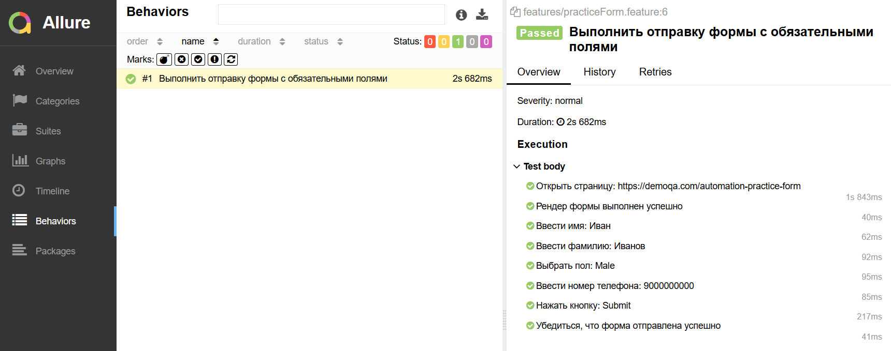

# java-ui-bdd-test

[](https://openjdk.org/)
[](https://maven.apache.org/)
[](https://cucumber.io/)
[](https://selenide.org/)
[](https://allurereport.org/)

Демонстрационный проект UI-тестов на Java с использованием **Cucumber (BDD)**, **Selenide** и **Allure**.

Тестируемое приложение — [DemoQA Automation Practice Form](https://demoqa.com/automation-practice-form).

---

## 🧰 Стек

| Компонент | Версия | Назначение |
|---|---|---|
| Java | 25 | Язык |
| Maven | 3.9+ | Сборка |
| JUnit Platform Suite | 5.11+ | Запуск Cucumber через JUnit 5 |
| Cucumber | 7.34.7 | BDD-фреймворк |
| Selenide | 7.17.0 | Обёртка над Selenium |
| Allure | 2.30.0 | Отчёты |

---

## 📁 Структура проекта
```
src/
├── main/java/ (пусто — весь код в test)
└── test/
├── java/
│ ├── pages/
│ │ └── PracticeFormPage.java [Page Object]
│ ├── runner/
│ │ └── RunCucumberTest.java [Точка входа: JUnit Platform Suite]
│ └── step/
│ ├── Hooks.java [@Before / @After для сценариев]
│ └── PracticeFormStep.java [Определения шагов]
└── resources/
├── features/
│ └── practiceForm.feature [Gherkin-сценарий]
└── selenide.properties [Настройки Selenide]
```
**Слои:**
- **Page Object** — локаторы и действия над страницей.
- **Step** — Java-реализация шагов, тонкий слой, делегирует в Page Object.
- **Feature** — Gherkin-описание сценариев на русском языке.
---
## 🚀 Быстрый старт

### Требования

- JDK 25+
- Maven 3.9+
- Google Chrome (последняя версия)

### Клонирование и запуск

```bash
git clone https://github.com/EugeneBubnov/java-ui-bdd-test.git
cd java-ui-bdd-test
mvn clean test
```
### Allure отчёт
```
mvn allure:serve
```

